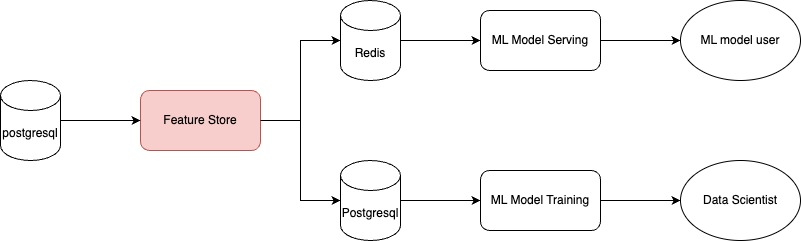

# feature-store

This is the feature store service of the [mini-demand-side-platform](https://github.com/mini-demand-side-platform/mini-demand-side-platform). 

A feature store does:

1. Create reusable features for data scientists.
2. Offer a centralized interface for both model training and model inference.
3. Integrate multiple data sources (not yet implemented here).

If you want to know more about what a feature store is, you can find more description [here](https://www.tecton.ai/blog/what-is-a-feature-store/).

When you add features in this feature store service, it creates a table in the PostgreSQL for all the metadata and sets key-value pairs in Redis. Then, we can have an interface for getting the features during both model training and serving. Check [example notebooks](https://github.com/mini-demand-side-platform/research) for more detail.

Currently, only support `string_mapping` and `scale` for the feature engineering.
## Tech Stack
- Redis
- Postgresql
- Fastapi


## Usages
You can import the postman collection in the `postman/collections` folder for all the api examples or you can check `localhost:8000/docs` on the swagger UI.
#### 1. Create Feature Store
Arguments:
- feature_store_name: The name of the feature store.
- offline_table_name: This table will have all the features after feature engineering.
- description: For you to add description for the feature store.
```bash
curl -X 'POST' \
  'http://localhost:8000/feature_store' \
  -H 'accept: application/json' \
  -H 'Content-Type: application/json' \
  -d '{
    "feature_store_name": "<feature_store_name>",
    "offline_table_name": "<offline_table_name>",
    "description": "<description>"
  }'
```
#### 2. List Feature Store
```bash
curl -X 'GET' \
    'http://localhost:8000/feature_store'
```
Expected output
```json
{
    "feature_store_id": [
        "<feature_store_id>", ...
    ],
    "feature_store_name": [
        "<feature_store_name>", ...
    ]
}
```
#### 3. Get Feature Store Info
```bash
curl -X 'GET' \
    'localhost:8000/feature_store/{{feature_store_id}}'
```

Expected output

```json
{
    "feature_store_id": [
        "<feature_store_id>"
    ],
    "feature_store_name": [
       "<feature_store_name>"
    ],
    "description": [
        "<description>"
    ],
    "offline_table_name": [
        "<offline_table_name>"
    ]
}
```
#### 4. Create String Mapping Feature
String mapping feature can help you do the encoding kind of feature engineering. 

Arguments:
- feature_name: The name of the feature.
- source_table_name: The source table name for the feature engineering.
- source_column_name: The source column name for the feature engineering.
- function_name: The postgresql function name for you to actully run the feature engineering job.
- description: For you to add description for the feature.
- mapping_rules: The mapping rules for you to specify the feature mapping from string to float. See example below.
```bash
curl -X 'POST' \
  'localhost:8000/feature_store/{{feature_store_id}}/feature/string_mapping' \
  -H 'accept: application/json' \
  -H 'Content-Type: application/json' \
  -d '{
    "feature_name": "<feature_name>",
    "source_table_name": "<source_table_name>",
    "source_column_name": "<source_column_name>",
    "function_name": "<function_name>",
    "description": "<description>",
    "mapping_rules": {"key1": value1, "key2": value2,"default": value3}
}'
```

If you have two kinds of fruit, apple and banana, in the machine learning feature engineering stage, we usually use one-hot encoding to represent the fruit.. It transform from 

|fruit|
|---|
|apple|
|banana|
|...|

 to 

|fruit_apple|fruit_banana|
|---|---|
|1|0|
|0|1|
|...|...|

you can do it in this feature store like this

create apple mapping:
```bash
curl -X 'POST' \
  'localhost:8000/feature_store/{{feature_store_id}}/feature/string_mapping' \
  -H 'accept: application/json' \
  -H 'Content-Type: application/json' \
  -d '{
    "feature_name": "fruit_mapping_apple",
    "source_table_name": "fruit_table",
    "source_column_name": "fruit",
    "function_name": "fruit_mapping_apple",
    "description": "<description>",
    "mapping_rules": {"apple": 1, "default": 0}
}'
```

create banana mapping:
```bash
curl -X 'POST' \
  'localhost:8000/feature_store/{{feature_store_id}}/feature/string_mapping' \
  -H 'accept: application/json' \
  -H 'Content-Type: application/json' \
  -d '{
    "feature_name": "fruit_mapping_banana",
    "source_table_name": "fruit_table",
    "source_column_name": "fruit",
    "function_name": "<function_name>",
    "description": "<description>",
    "mapping_rules": {"banana": 1, "default": 0}
}'
```
#### 5. Create Scale Feature
Scale feature can help you do the scale kind of feature engineering. 

Arguments:
- feature_name: The name of the feature.
- source_table_name: The source table name for the feature engineering.
- source_column_name: The source column name for the feature engineering.
- function_name: The postgresql function name for you to actully run the feature engineering job.
- description: For you to add description for the feature.
- math_operation: The math operation for you to do addition, subtraction,multiplication or division on your featuer. See example below.
```bash
curl -X 'POST' \
  'localhost:8000/feature_store/{{feature_store_id}}/feature/scale' \
  -H 'accept: application/json' \
  -H 'Content-Type: application/json' \
  -d '{
    "feature_name": "feature_name",
    "source_table_name": "source_table_name",
    "source_column_name": "source_column_name",
    "function_name": "function_name",
    "description": "description",
    "math_operation": "<math_operation>"
}'
```

Sometime, the data scientist want to `standardize` the feature and keep the same rule during model training and model inference. For example, you have the height of a person as a input feature and you want to standardize the height feature with 170cm as average and 10cm as standard deviation. Then you can do:

```bash
curl -X 'POST' \
  'localhost:8000/feature_store/{{feature_store_id}}/feature/scale' \
  -H 'accept: application/json' \
  -H 'Content-Type: application/json' \
  -d '{
    "feature_name": "height standardize",
    "source_table_name": "<source_table_name>",
    "source_column_name": "<source_column_name>",
    "function_name": "<function_name>",
    "description": "<description>",
    "math_operation": "({} - 170)/10"
}'
```

The `{}` in the math_operation is the placeholder for the input.

#### 6. List Features
List all the feature in the feature store by feature store id.
```bash
curl -X 'GET' \
  'localhost:8000/feature_store/{{feature_store_id}}/feature' 
```

Expected output:
```json
{
    "feature_id": [
        "<feature_id_1>",
        "<feature_id_2>",
        ...
    ],
    "feature_name": [
        "<feature_name_1>",
        "<feature_name_2>",
        ...
    ],
    "source_table_name": [
        "<source_table_name_1>",
        "<source_table_name_2>",
        ...
    ],
    "source_column_name": [
        "<source_column_name_1>",
        "<source_column_name_2>",
        ...
    ],
    "feature_function_type": [
        "<feature_function_type_1>",
        "<feature_function_type_2>",
        ...
    ]
}
```
#### 7. Delete Feature
Delete feature by feature_id
```bash
curl -X 'DELETE' \
  'localhost:8000/feature_store/{{feature_store_id}}/feature/{{feature_id}}' 
```
#### 8. Generate Offline Features 
After create all the features, this API will generate all the feature to the offline table. 
```bash
curl -X 'POST' \
  'localhost:8000/feature_store/{{feature_store_id}}/offline_table' 
```
#### 9. Get Online features
During model inference stage,
```bash
curl -X 'POST' \
  'localhost:8000/online_features' \
  -H 'accept: application/json' \
  -H 'Content-Type: application/json' \
  -d '{
        "feature_ids": [
            "<feature_id_1>",
            "<feature_id_2>",
            ...
        ],
        "feature_store_function_types": [
            "<feature_store_function_type_1>",
            "<feature_store_function_type_2>",
            ...
        ],
        "inputs": [
            "<input_1>",
            "<input_2>",
            ...
        ]
    }'
```

#### 10. Delete Feature Store
Delete feature store by feature store id.
```bash
curl -X 'DELETE' \
  'localhost:8000/feature_store/<feature_store_id>' 
```

## Requirements
- docker
- docker-compose 
## Setup
#### 1. Activate databases 
```
git clone git@github.com:mini-demand-side-platform/databases.git
cd databases 
make run-all-with-example-data
```
#### 2. Run Feature Store
```bash
docker run -it --rm --network mini-demand-side-platform \
    -p 8000:8000 \
    -e olap_host='postgresql' \
    -e cache_host='redis' \
    raywu60kg/feature-store
```

## TODO
- Time based feature
- ORM
- Unit Test
- Integration test
- Different source of input